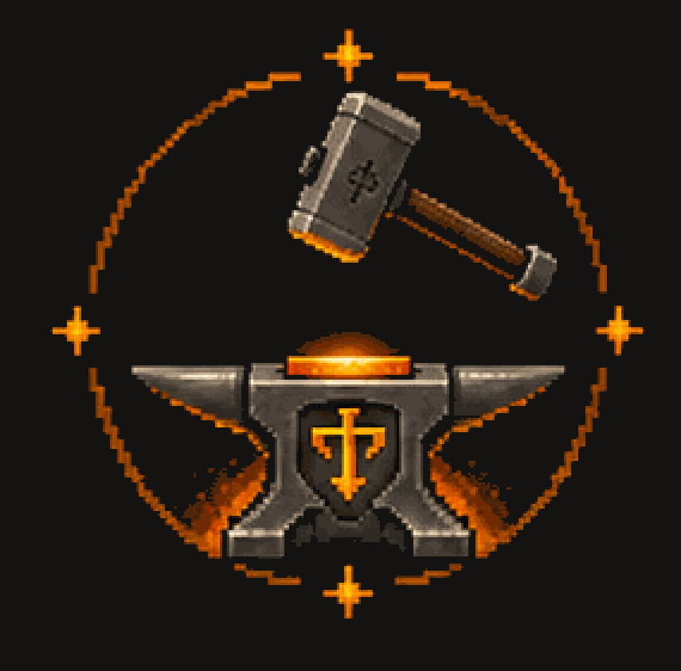

<div align="center">



# keepwright

**Set up and keep a high-quality engineering architecture in any git repo.**

</div>

A Claude Code plugin that implants a constitution, structured rules, GitHub
Actions (CI, AI PR review, `@claude` mention, safe auto-merge), portable
validators, and git hooks — detecting your stack and adapting. After setup it
keeps maintaining: it audits the repo and uses multi-agent workflows to derive
your design and writing-voice patterns, then turns them into rules and validators.

## Install

Run each `/plugin` command on its own — don't paste both at once.

**1. Add the marketplace**

```
/plugin marketplace add leonardocandiani/keepwright
```

**2. Install the plugin**

```
/plugin install keepwright
```

**3. Reload to activate**

```
/reload-plugins
```

Loads keepwright's commands, skills, and agents into the current session — no Claude Code restart needed.

## Commands

| Command | What it does |
|---------|--------------|
| `/keepwright:setup` | Interactive wizard. Detects the stack and installs the full architecture. |
| `/keepwright:audit` | Checks integration coverage of an existing repo against the architecture. |
| `/keepwright:review` | Compares repo state against the patterns derived from your code and docs. |
| `/keepwright:overhaul` | Full-repo overhaul orchestrator: parallel recon, a grilling interview, architecture by a frontier model, execution delegated to cheaper models, lessons catalyzed into rules. Every phase emits an artifact in `.overhaul/`, so work resumes across sessions and models. Use it to refactor, modernize, or clean up an existing repo end to end. |

## Workflows

Multi-agent orchestration the commands run under the hood — each fans out parallel agents and synthesizes the result. You normally don't call these directly (the commands trigger them), but they're invocable on their own for advanced use:

| Workflow | What it does | Triggered by |
|----------|--------------|--------------|
| `/keepwright:map-brownfield` | Parallel read-only analysis of a large repo, synthesized into a config enrichment. | `setup` (large repos) |
| `/keepwright:derive-patterns` | Mines the repo's design + writing-voice patterns into rules and validator specs. | `setup`, `review` |
| `/keepwright:verify-setup` | Adversarially verifies a fresh setup in parallel: secrets, equalization, workflow YAML, validators, the P1–P5 hierarchy. | `audit --deep` |

## Skills & agents

- **Skills** — `keepwright` (the methodology behind the wizard), `pr-review` (the review procedure, also installed into each target repo as a `.claude/commands/pr-review.md` slash command so the CI resolves `/pr-review #N` on a clean GitHub-hosted runner), and `overhaul` (the full-repo overhaul orchestrator: recon → grilling → architect specs → delegated execution → catalysis, with artifacts under `.overhaul/`).
- **Agents** — `design-auditor` and `voice-auditor`: read-only auditors that inspect the repo's design and writing-voice dimensions.

## Three layers

- **Wizard** (`/keepwright:setup`) — an interactive command that detects git,
  stack (Node/Deno/Python/etc), Claude config, and existing CI, then installs
  the constitution, rules, workflows, validators, and hooks. Destructive steps
  ask for explicit approval.
- **Engine** — the deterministic part: portable validators and git hooks that
  run the same way on every machine and in CI. No model in the loop, no flaky
  output.
- **Workflows** — multi-agent orchestration that audits an existing repo, derives
  its design and writing-voice patterns, and writes them back as rules and
  validators.

## What it installs

- **Constitution** — `CLAUDE.md` as an equalized index of the rules, with the
  always-loaded invariants inline.
- **Rules** — `.claude/rules/`: invariants, pipeline equalization, the P1–P5
  epistemic hierarchy, PR flow, lesson catalysis, parallel work streams, safe
  merge, empirical proof before merge, and issue triage.
- **GitHub Actions** — `ci.yml` (type-check, lint, validators), `pr-auto-review.yml`
  (heuristic + Claude review over OAuth), `claude-mention.yml` (`@claude` on
  demand), `pr-auto-merge.yml` (auto-merge only for inert changes),
  `issue-triage.yml` (advisory labels via free GitHub Models), and a deploy
  template picked by stack.
- **Issue triage** — new issues are classified by GitHub Models (free in Actions,
  no secret) and get advisory labels + a summary comment, deterministically. It
  never closes, assigns, or merges — least-privilege by construction, so a prompt
  injection in an issue body cannot reach code or secrets. Ships with issue
  templates and `scripts/seed-labels.sh`. Turn it off with `"issues": { "triage":
  "off" }`.
- **Validators** — portable TypeScript checks: secret scanning, CLAUDE.md sync,
  epistemic-hierarchy gate, empirical-proof gate, webhook-active check.
- **Hooks** — lefthook (pre-commit validators + type-check, conventional
  commit-msg, force-push guard on main) plus structure and TODO generators.

## Auth

The AI workflows use `CLAUDE_CODE_OAUTH_TOKEN`. Run `/install-github-app` and
pick the subscription/OAuth option — it wires the token for you. Without the
secret, the AI jobs skip gracefully. An API key is a documented fallback, not
recommended.

If you need to set the secret by hand, `scripts/setup-oauth-secret.sh
<owner>/<repo>` reads the token from the macOS Keychain or
`CLAUDE_CODE_OAUTH_TOKEN`, validates its shape, and sets it without mangling.

## Double merge gate

Real auto-merge runs only for inert changes (docs, chronology, work-stream
notes). Anything touching code, CI, rules, deploy, or config is human-gated: the
AI prepares the PR, a human gives a one-line go. Detail in
`templates/rules/07-safe-merge.md.template`.

## License

MIT. See [LICENSE](LICENSE) and [AUTHORS.md](AUTHORS.md).
